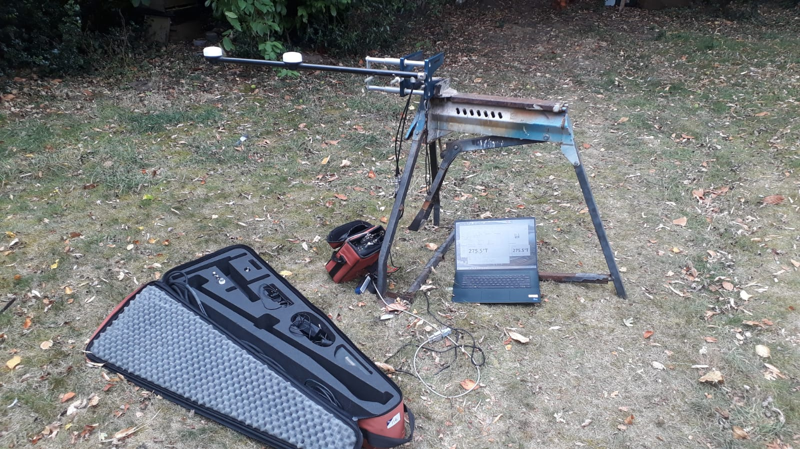

# GPS Compass Display

A cross-platform project for reading, parsing, and displaying **NMEA GPS/heading data**.
Originally built in **Python (Tkinter GUI)** for Windows with Bluetooth/serial GPS receivers, and extended with an **Android app** for mobile use. Primarily intended to work with the PPM 4011 series of professional GPS compasses, but shoudl work with any GPS compass using the Realtime Kinematics Layer (RTK)




---

## 📡 What It Does

This project connects to a GPS receiver (via serial / Bluetooth-serial on Windows, or via Bluetooth on Android), parses common NMEA sentences, and displays **real-time navigation data**:

* Heading (with FIR/running average smoothing, offset correction, and wraparound handling)
* Satellites in view / satellites used
* Fix status, UTC time, altitude
* PDOP/HDOP/VDOP (accuracy metrics)
* Raw NMEA sentence log (Python GUI only)

The focus is on **heading display** for use in radio, navigation, and field applications.

---

## 🖥️ Python GUI (Windows/Linux/macOS)

The Python desktop version is built with **Tkinter** and **pyserial**.

### Features

* Connect to serial/Bluetooth GPS devices (e.g., Brainboxes BT-Serial adapter)
* Configurable:

  * Port selection and auto-refresh
  * Baud rate (default 38400 N81)
  * FIR filter window size
  * Heading offset (°)
* Two display modes:

  * **Main GUI**: full status grid, heading canvas, NMEA log
  * **Mini window**: compact heading + status display (optionally always-on-top)
* Saves user settings (JSON) for next run

### Example NMEA sentences handled

* `$GPGGA` – Fix, satellites, altitude
* `$GPGSA` – Mode, PDOP/HDOP/VDOP
* `$GPZDA` – Date/Time
* `$GPHDT` – Heading

### Running

1. Install dependencies:

   ```sh
   pip install pyserial
   ```
2. Run:

   ```sh
   python nmea_display.py
   ```

### Build as `.exe`

To create a stand-alone executable on Windows:

```sh
pip install pyinstaller
pyinstaller --onefile --noconsole nmea_display.py
```

The binary will be under `dist/nmea_display.exe`.

---

## 📱 Android App

The Android version is a **native Kotlin app** with a simple interface designed for mobile heading display.

### Features

* Connects to paired Bluetooth GPS/heading devices
* Displays:

  * Filtered heading (large text)
  * Satellite count and fix status
  * Basic UTC timestamp
* Minimal UI optimized for full-screen use
* Intended as a lightweight “field display” (no NMEA log window, no mini-window)

### Building the APK

1. Install [Android Studio](https://developer.android.com/studio).
2. Open the project folder `gps-heading-android/`.
3. Ensure the Android SDK is installed (Platform 34, Build-tools 34.0.0).
4. Build → *Make Project* or run:

   ```sh
   ./gradlew assembleDebug
   ```
5. The APK will be generated at:

   ```
   app/build/outputs/apk/debug/app-debug.apk
   ```

### Installing

Copy the APK to your device and install manually, or deploy directly via Android Studio.

---

## ⚙️ Requirements

* **Python version**: 3.8+
* **Android**: API level 24+ (Android 7.0+)
* GPS receiver that outputs standard NMEA sentences over serial/Bluetooth.

---

## 🚀 Use Cases

* Amateur radio projects (beam heading, antenna alignment)
* Marine or vehicle navigation
* GPS compass testing
* Educational use for understanding NMEA data

---

## 📂 Project Structure

```
/nmea_display.py       → Python GUI app
/settings.json         → Saved Python GUI settings
/gps-heading-android/  → Android Studio project
```

---

## 📜 License

MIT License – free to use, modify, and distribute.

---

## 🙌 Acknowledgements

* [PySerial](https://pyserial.readthedocs.io/)
* [Tkinter](https://docs.python.org/3/library/tkinter.html)
* [Android Bluetooth API](https://developer.android.com/guide/topics/connectivity/bluetooth)
